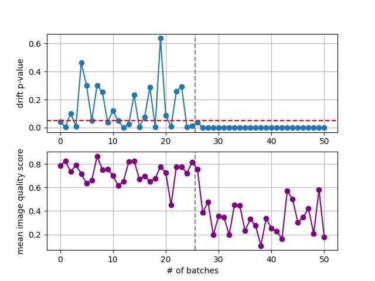

# archimedes_optics
Current status (ONLY for preliminary video testing): 

* ARNIQA is right most of the time in terms of image quality, without training (kadid10k backbone) by using the average we can detect possible drift although is not fully tested yet. In some videos arniqa suggests issues without distortions. It can always provide image quality ) unlike LSTM and DDRIFT) without training, although drift detection require more justification.

* LSTM is occasionally right without training (pretty unstable) without training (using kadid10k backbone with kadid10k lstm pretrained). We possibly need custom LSTM training

* DDRIFT has worked with videos before, although with a custom trained backbone (with disjoint drone footage and artificial distortions). In the case of using the arniqa kadid10k backbone, this setup cannot show p-value drift in video. A possible requirement is the training with custom dataset (drone images, labels) where we can use a disjoint dataset by camera footage, create labels according to clean footage with artificial distortions. It is a drawback but can be justified.

The results below are a decent effort so far for the factory_inspection + ARNIQA backbone video

	

