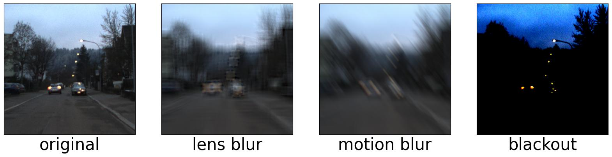

# Real-Time Quality Monitoring and Anomaly Detection for Vision Sensors in Connected and Autonomous Vehicles

This repository contains the official implementation of the paper:

**Real-Time Quality Monitoring and Anomaly Detection for Vision Sensors in Connected and Autonomous Vehicles**  
*Accepted in IEEE Access*


## Table of Contents
- [Real-Time Quality Monitoring and Anomaly Detection for Vision Sensors in Connected and Autonomous Vehicles](#real-time-quality-monitoring-and-anomaly-detection-for-vision-sensors-in-connected-and-autonomous-vehicles)
	- [Table of Contents](#table-of-contents)
	- [Overview](#overview)
	- [Installation](#installation)
	- [Usage](#usage)
	- [Datasets](#datasets)
	- [Visualizations](#visualizations)
		- [Example GIFs:](#example-gifs)
		- [Example Input Images:](#example-input-images)
		- [Example Output:](#example-output)
	- [Citation](#citation)
	- [License](#license)

---

## Overview
This project presents a real-time system for quality monitoring and anomaly detection of vision sensors in connected and autonomous vehicles (CAVs). The system utilizes PyTorch-based deep learning models to identify issues such as:
- Blackout
- Lens Blur
- Motion Blur

Key highlights:
- Real-time processing capabilities
- Robust detection of anomalies
- Effective integration into CAV environments

## Installation

<details>
<summary><b>Requirements</b></summary>

- Python 3.8+
- PyTorch  
- Additional dependencies listed in `requirements.txt`

</details>

<details>
<summary><b>Setup Instructions</b></summary>

1. Clone the repository:
   ```bash
   git clone https://github.com/icsa-hua/archimedes-optics.git
   cd archimedes-optics
   ```
2. Create a virtual environment (optional but recommended):
   ```bash
   python -m venv venv
   source venv/bin/activate
   ```
3. Install the dependencies:
   ```bash
   pip install -r requirements.txt
   ```

</details>

## Usage

<details>
<summary><b>Running the Code</b></summary>

1. Ensure that the required dataset(s) are downloaded and accessible.
2. Run the bash script for training or evaluation (customizable and suitable for mass testing):
   ```bash
   chmod +x run_all_tests.sh
   ./run_all_tests.sh
   ```
3. For additional options, refer to the help menu:
   ```bash
   python main.py --help
   ```

</details>

## Datasets
The datasets used in this project can be accessed via the following link: 

[Download Dataset](https://drive.google.com/your-dataset-link)

Ensure that the dataset is structured as follows:
```

```

## Visualizations
Below are some sample outputs and visualizations from the system:

### Example GIFs:
Anomaly detection preliminary test in factory inspection drone. This is a "stress test" with alternating brightness and salt-and pepper noise. 

(The paper is uses different data and distortions, based on the CAV literature)


### Example Input Images:
Input samples (Zurich streets dashcam):


### Example Output:

Distortion detection example of Zurich streets dashcam with Lens blur. 

The gray area indicates when the distortion occurs:


## Citation
If you find this work useful in your research, please consider citing our paper:

```bibtex
@article{politi2025real,
  title={Real-Time Quality Monitoring and Anomaly Detection for Vision Sensors in Connected and Autonomous Vehicles},
  author={Your Name and Co-authors},
  journal={IEEE Access},
  year={2025}
}
```

## License
This project is licensed under the MIT License. See the [LICENSE](LICENSE) file for details.
